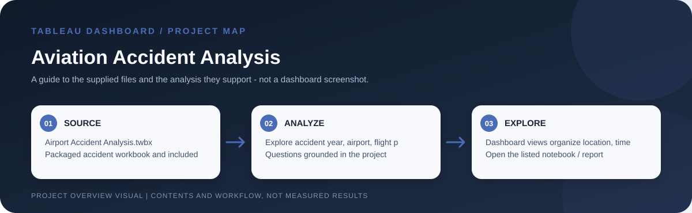

# Aviation Accident Analysis

> Workflow illustration only; it is not a dashboard screenshot or a source of measured results.

## Purpose

This project uses an interactive Tableau dashboard to examine patterns in aviation accidents and incidents. It helps readers explore how recorded events vary by time, airport/location, flight phase, flight purpose and aircraft damage. It is descriptive analysis, not a measure of aviation risk or causation.

## Problem and analysis

The project makes the supplied data easier to inspect through interactive filters and grouped comparisons. Its focus is exploratory: users can examine how records vary across the dimensions represented in the workbook rather than rely on a single aggregate.

## Project files

`Airport Accident Analysis.twbx` and the supporting `Airport Accident Data.xlsx`.

## How to open

Open the listed Tableau workbook in Tableau Desktop or Tableau Public. Packaged `.twbx` files are self-contained workbook packages where their sources are embedded; for a `.twb` workbook, keep its supporting CSV files available and reconnect data sources if Tableau requests them.

## Interpretation notes

Check the workbook's field definitions, coverage period and source before comparing event counts. Counts alone do not account for flight volume or exposure.
