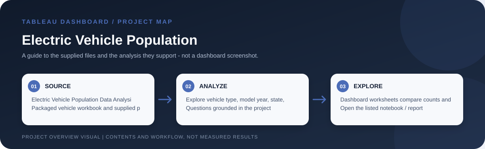

# Electric Vehicle Population

> Workflow illustration only; it is not a dashboard screenshot or a source of measured results.

## Purpose

This dashboard explores the electric-vehicle population using vehicle type, state, model year, manufacturer, electric range and Clean Alternative Fuel Vehicle (CAFV) eligibility. It supports descriptive comparisons of the vehicles represented in the supplied data.

## Problem and analysis

The project makes the supplied data easier to inspect through interactive filters and grouped comparisons. Its focus is exploratory: users can examine how records vary across the dimensions represented in the workbook rather than rely on a single aggregate.

## Project files

`Electric Vehicle Population Data Analysis.twbx` and `Electric_Vehicle_Population_Data.csv`.

## How to open

Open the listed Tableau workbook in Tableau Desktop or Tableau Public. Packaged `.twbx` files are self-contained workbook packages where their sources are embedded; for a `.twb` workbook, keep its supporting CSV files available and reconnect data sources if Tableau requests them.

## Interpretation notes

Population counts depend on the dataset?s coverage and update date. CAFV eligibility and electric-range fields should be interpreted using the source definitions.
