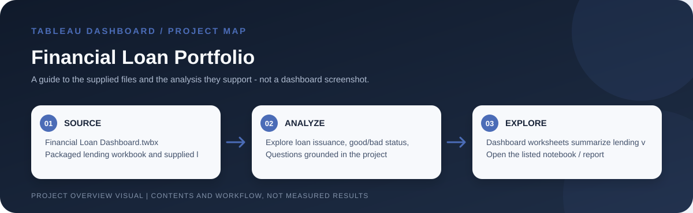

# Financial Loan Portfolio

> Workflow illustration only; it is not a dashboard screenshot or a source of measured results.

## Purpose

This dashboard summarizes a lending portfolio through loan issuance, good/bad loan status, grade, term and geography. It helps explore how the included loans are distributed across the workbook's dimensions.

## Problem and analysis

The project makes the supplied data easier to inspect through interactive filters and grouped comparisons. Its focus is exploratory: users can examine how records vary across the dimensions represented in the workbook rather than rely on a single aggregate.

## Project files

`Financial Loan Dashboard.twbx` and `Financial Loan Data.csv`.

## How to open

Open the listed Tableau workbook in Tableau Desktop or Tableau Public. Packaged `.twbx` files are self-contained workbook packages where their sources are embedded; for a `.twb` workbook, keep its supporting CSV files available and reconnect data sources if Tableau requests them.

## Interpretation notes

The workbook is a descriptive portfolio analysis. Its labels and included records do not establish current credit performance or causal drivers.
