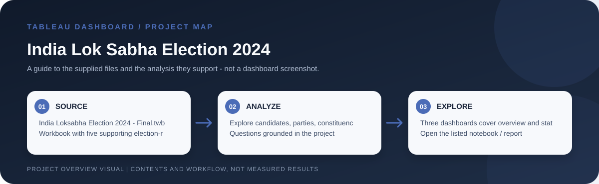

# India Lok Sabha Election 2024

> Workflow illustration only; it is not a dashboard screenshot or a source of measured results.

## Purpose

This workbook explores the 2024 India Lok Sabha election through constituency, candidate, party, state, vote and alliance results. The three dashboards provide overview and state/demographic perspectives on the supplied election data.

## Problem and analysis

The project makes the supplied data easier to inspect through interactive filters and grouped comparisons. Its focus is exploratory: users can examine how records vary across the dimensions represented in the workbook rather than rely on a single aggregate.

## Project files

`India Loksabha Election 2024 - Final.twb`, plus `constituencywise_details.csv`, `constituencywise_results.csv`, `partywise_results.csv`, `states.csv` and `statewise_results.csv`.

## How to open

Open the listed Tableau workbook in Tableau Desktop or Tableau Public. Packaged `.twbx` files are self-contained workbook packages where their sources are embedded; for a `.twb` workbook, keep its supporting CSV files available and reconnect data sources if Tableau requests them.

## Interpretation notes

The `.twb` workbook uses external CSV inputs; keep all five files together and preserve the configured paths or reconnect the data sources in Tableau. Results should be interpreted using the supplied field definitions and election coverage.
