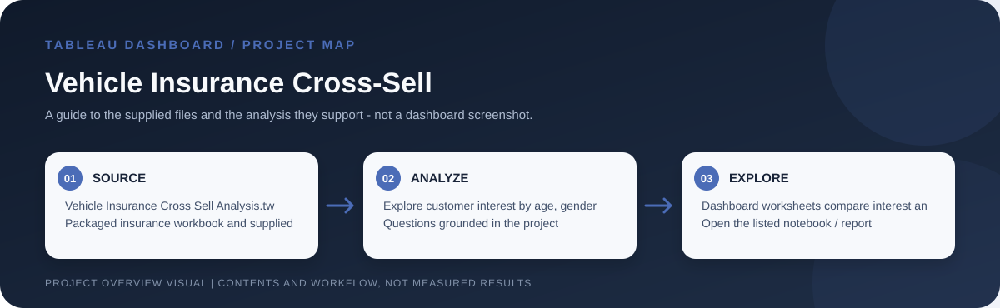

# Vehicle Insurance Cross-Sell

> Workflow illustration only; it is not a dashboard screenshot or a source of measured results.

## Purpose

This dashboard explores customer interest in vehicle insurance using customer and vehicle characteristics, including age, gender, driving history and vehicle damage. It supports segment comparisons within the supplied records; it is not a validated underwriting or sales recommendation.

## Problem and analysis

The project makes the supplied data easier to inspect through interactive filters and grouped comparisons. Its focus is exploratory: users can examine how records vary across the dimensions represented in the workbook rather than rely on a single aggregate.

## Project files

`Vehicle Insurance Cross Sell Analysis.twbx` and `Vehicel Insurance Data.csv`.

## How to open

Open the listed Tableau workbook in Tableau Desktop or Tableau Public. Packaged `.twbx` files are self-contained workbook packages where their sources are embedded; for a `.twb` workbook, keep its supporting CSV files available and reconnect data sources if Tableau requests them.

## Interpretation notes

Customer-interest categories describe the supplied dataset and do not establish causation or predict outcomes for a different population.
